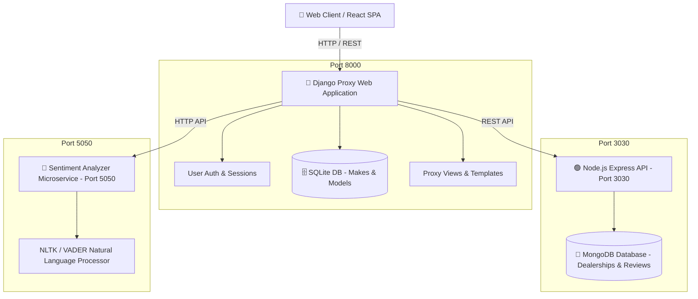
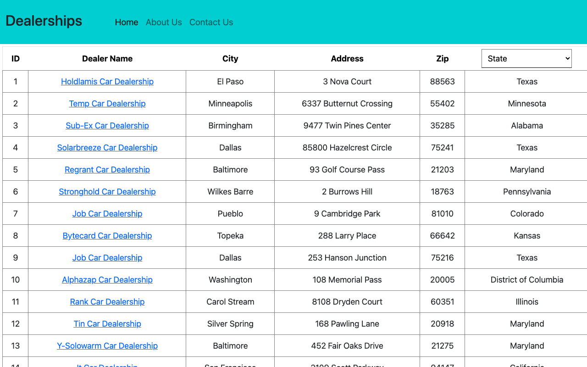
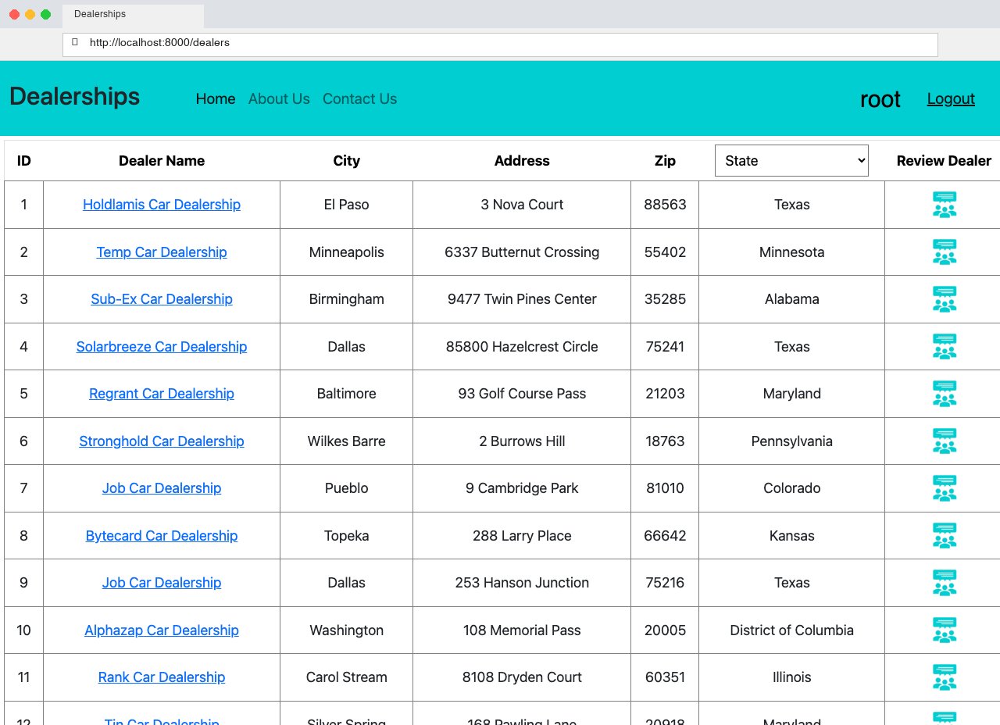
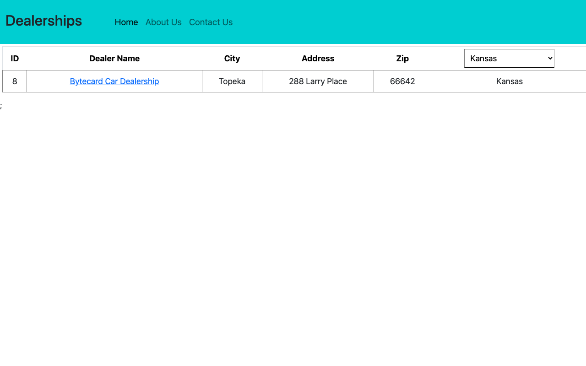
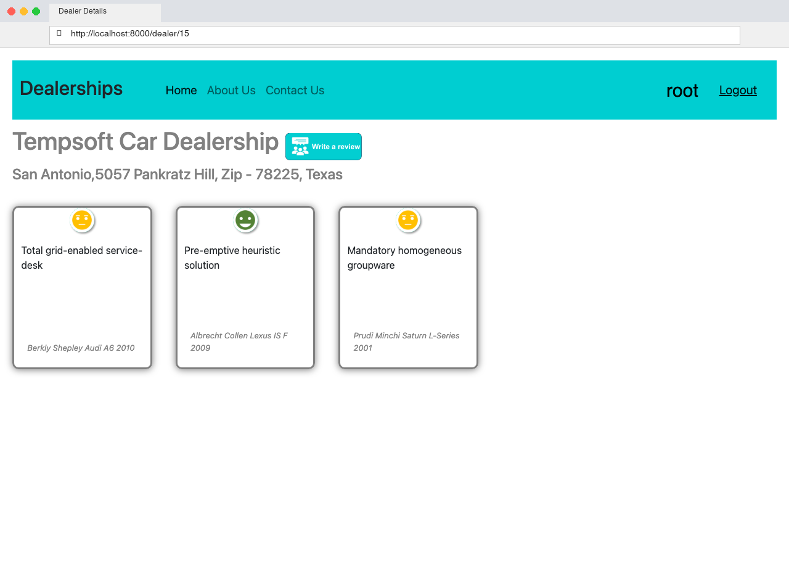
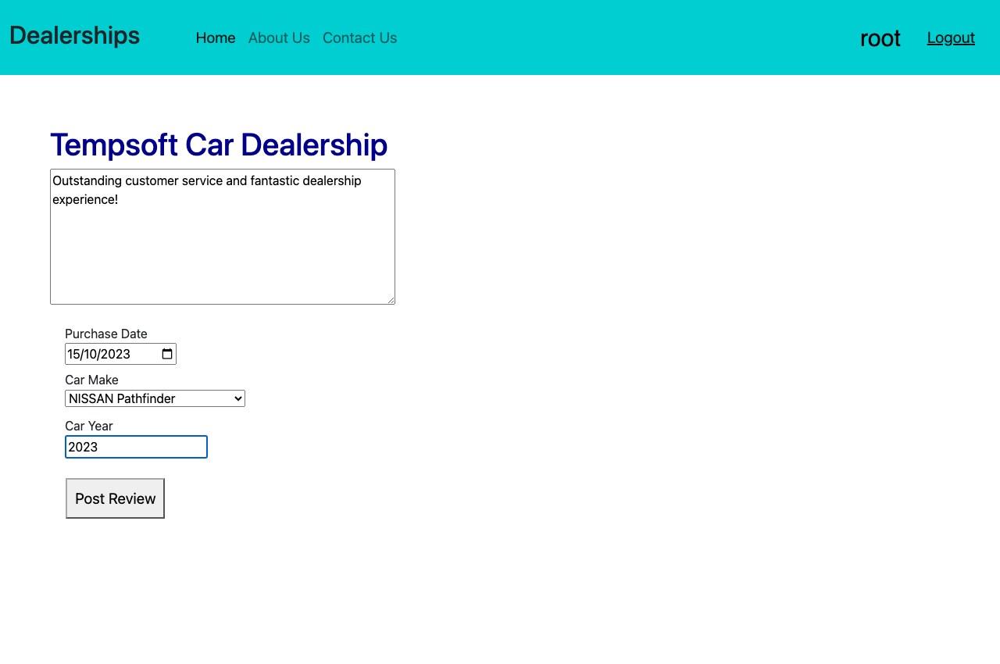
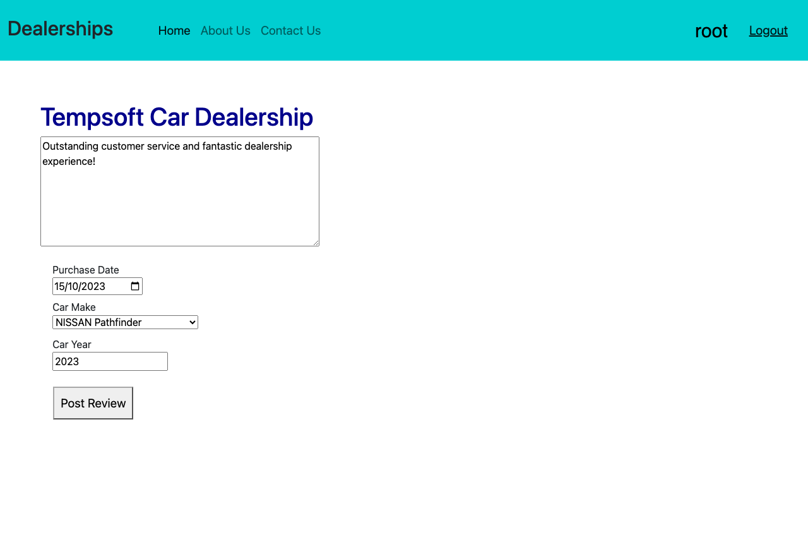
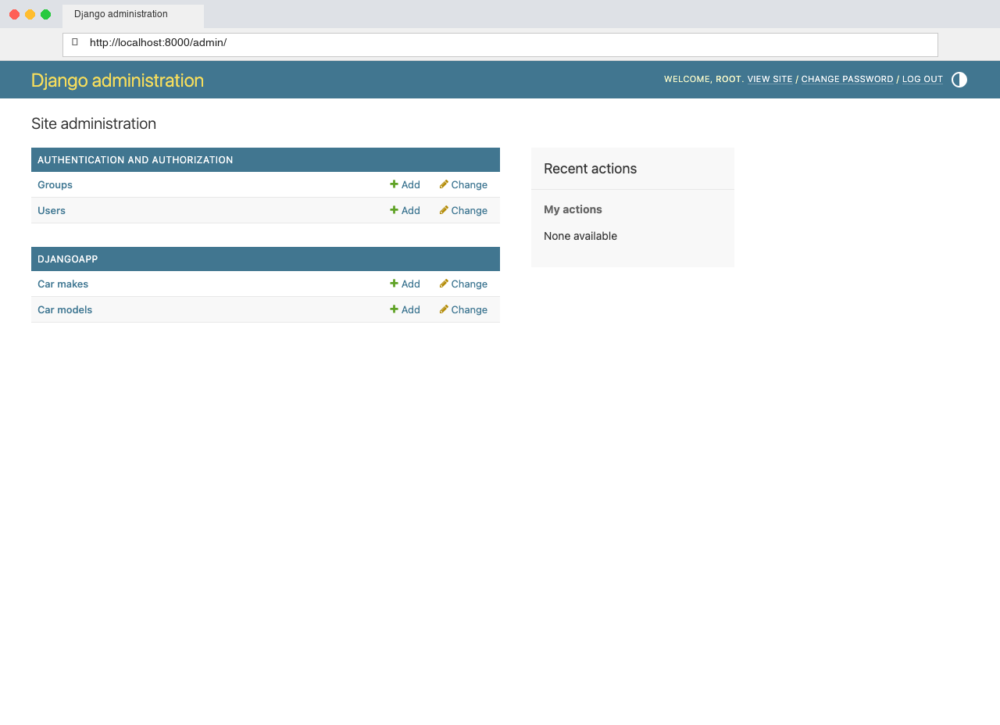
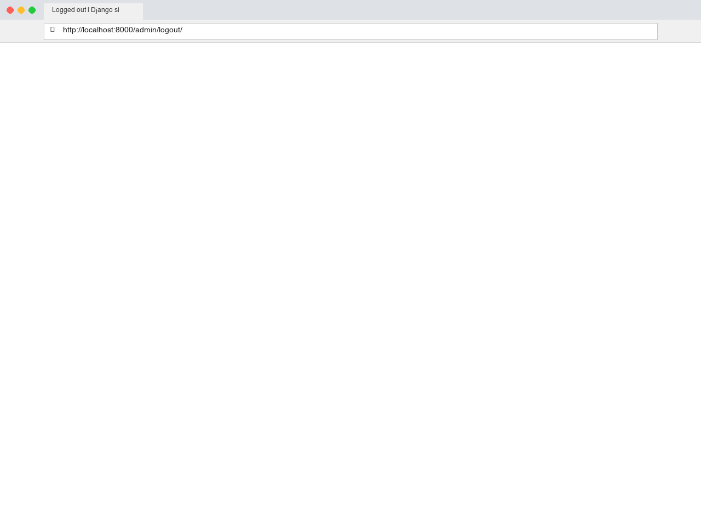

# 🚗 Best Cars Dealership - Full-Stack Capstone Application

[](https://www.djangoproject.com/)
[](https://reactjs.org/)
[](https://nodejs.org/)
[](https://expressjs.com/)
[](https://www.mongodb.com/)
[](https://www.docker.com/)
[](https://kubernetes.io/)
[](https://cloud.ibm.com/)
[](https://github.com/features/actions)

> **Fullstack Developer Capstone Project**: A modern, microservice-based web application for exploring nationwide car dealerships, submitting customer reviews, viewing microservice sentiment analysis, and managing vehicle inventories.

---

## 📌 Table of Contents
- [✨ Key Features](#-key-features)
- [🏗 System Architecture](#-system-architecture)
- [🖼 Visual Showcase & Screenshots](#-visual-showcase--screenshots)
- [🛠 Tech Stack & Tools](#-tech-stack--tools)
- [📡 API Endpoints Reference](#-api-endpoints-reference)
- [🚀 Quick Start & Installation](#-quick-start--installation)
- [🐳 Containerization & Kubernetes](#-containerization--kubernetes)
- [🔄 CI/CD Pipeline](#-cicd-pipeline)
- [📄 License & Credits](#-license--credits)

---

## ✨ Key Features

- **🔐 User Authentication**: Full Django session & REST registration, login, logout, and persistent state using React frontend components.
- **🏢 Dealership Catalog**: Dynamic listing of all US car dealerships with interactive state filtering and responsive UI table views.
- **💬 Dealer Reviews & Details**: Dedicated view per dealership showcasing customer ratings, purchase details, car model tags, and sentiment badges.
- **🤖 Microservice Sentiment Analysis**: Containerized Python NLTK/VADER microservice analyzing review text sentiment (*Positive*, *Neutral*, *Negative*) in real-time.
- **🚗 Car Make & Model Management**: Integrated Django ORM Models (`CarMake` & `CarModel`) registered with custom Django Admin inline controls.
- **⚡ Node.js & MongoDB Backend Service**: High-performance Node Express API container servicing dealer records and mongo review documents.
- **🐳 Multi-Container Orchestration**: Production-ready `docker-compose` setup and Kubernetes deployment manifest (`deployment.yaml`).
- **🛡 Automated CI/CD Pipeline**: GitHub Actions workflow running automated Flake8 Python linting and React JS build verification.

---

## 🏗 System Architecture



---

## 🖼 Visual Showcase & Screenshots

### 1. 🏢 Dealership Catalog Home Page (Public View)
Browse all nationwide dealerships with clear location details, addresses, and states.


---

### 2. 🔐 Authenticated Home View & State Filtering
Logged-in users can filter dealerships by state (e.g. Kansas) and access the **Review Dealer** action.



---

### 3. 💬 Dealer Reviews & Sentiment Analysis
Detailed view for a specific dealer showing past customer reviews paired with automated AI sentiment badges.


---

### 4. 📝 Post Review Submission Form
Authenticated customers submit vehicle review details including purchase date, car make, model, and year.


---

### 5. 🏷️ Newly Added Review with Sentiment Badge
The published review appears live on the dealer profile with sentiment tags generated instantly.


---

### 6. ⚙️ Django Admin Dashboard Management
Superusers manage `CarMake` and `CarModel` relational database records via inline admin tools.



---

## 🛠 Tech Stack & Tools

| Component | Technology | Description |
| :--- | :--- | :--- |
| **Frontend** | React 18, Bootstrap 5, HTML5/CSS3 | Responsive Single Page Application UI |
| **Proxy Server** | Django 5.1, Python 3.10 | Proxy service, session auth & static rendering |
| **Database Microservice** | Node.js, Express.js, Mongoose | RESTful API for dealers and reviews data |
| **Database** | MongoDB 6.0 | Document store for dealerships & reviews |
| **Sentiment Microservice**| Python, Flask / FastAPI, NLTK | Natural Language Sentiment Analysis Microservice |
| **Containerization** | Docker, Docker Compose | Application container packaging |
| **Orchestration** | Kubernetes, IBM Code Engine | Deployment manifest & service scaling |
| **CI/CD** | GitHub Actions | Automated linting & build verification |

---

## 📡 API Endpoints Reference

### Django Proxy Endpoints (`Port 8000`)
- `GET /dealers` — Main React SPA Dealers catalog
- `GET /djangoapp/get_dealers` — Proxy endpoint fetching all dealers
- `GET /djangoapp/get_dealers/<state>` — Proxy endpoint fetching dealers by state
- `GET /djangoapp/dealer/<dealer_id>` — Proxy endpoint fetching dealer details by ID
- `GET /djangoapp/reviews/dealer/<dealer_id>` — Proxy endpoint fetching reviews for a dealer
- `POST /djangoapp/add_review` — Submit new review payload with sentiment analysis
- `GET /djangoapp/get_cars` — Fetch pre-seeded Car Makes & Models list
- `POST /djangoapp/login` — User authentication endpoint
- `POST /djangoapp/register` — User signup registration endpoint
- `GET /djangoapp/logout` — User logout session termination

### Express Mongo Backend Microservice (`Port 3030`)
- `GET /fetchDealers` — Retrieve all 50 dealership documents
- `GET /fetchDealers/<state>` — Retrieve dealership documents by state
- `GET /fetchDealer/<id>` — Retrieve single dealership document by ID
- `GET /fetchReviews/dealer/<dealer_id>` — Retrieve reviews for specific dealership
- `POST /insertReview` — Insert a new review document into MongoDB

### Sentiment Analyzer Microservice (`Port 5050`)
- `GET /analyze/<text>` — Returns sentiment JSON output (`positive`, `neutral`, `negative`)

---

## 🚀 Quick Start & Installation

### Prerequisites
- [Git](https://git-scm.com/)
- [Docker & Docker Compose](https://www.docker.com/)
- [Python 3.10+](https://www.python.org/)
- [Node.js 18+](https://nodejs.org/)

### 1. Clone Repository
```bash
git clone https://github.com/MahmoudEsawi/xrwvm-fullstack_developer_capstone.git
cd xrwvm-fullstack_developer_capstone
```

### 2. Start Backend Databases & Node API Services via Docker
```bash
cd server/database
docker-compose up -d --build
```

### 3. Start Sentiment Analyzer Microservice
```bash
cd ../sentiment
docker build -t sentiment-analyzer .
docker run -d -p 5050:5050 sentiment-analyzer
```

### 4. Setup & Launch Django Proxy Application
```bash
cd ../
python3 -m venv djangoenv
source djangoenv/bin/activate
pip install -r requirements.txt

# Run migrations and start server
python manage.py makemigrations
python manage.py migrate
python manage.py runserver 0.0.0.0:8000
```

---

## 🐳 Containerization & Kubernetes

### Build Django Application Docker Image
```bash
cd server
docker build -t us.icr.io/sn-labs-mahmoudesawi/dealership:latest .
```

### Deploy to Kubernetes Cluster
```bash
kubectl apply -f deployment.yaml
kubectl port-forward deployment.apps/dealership 8000:8000
```

---

## 🔄 CI/CD Pipeline

The repository includes an automated GitHub Actions workflow defined in `.github/workflows/main.yml`.

- **Job 1 (`lint-python`)**: Evaluates Python files using `flake8`.
- **Job 2 (`lint-js`)**: Validates React frontend dependencies and builds production assets.

---

## 📄 License & Credits

Developed as part of the **IBM Full-Stack Software Developer Professional Certificate** Capstone Project.
Licensed under the [MIT License](LICENSE).